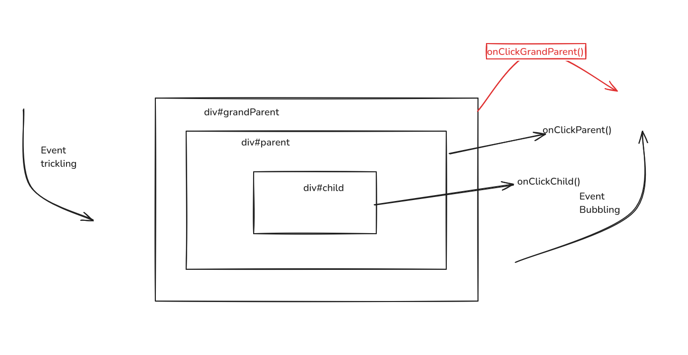

# Event Propogation in Javascript.

There are two ways of  event propogation in the DOM tree. 

## Usage with an example



### Event Bubbling

In case of event bubbling when we click on a child method i.e, onClickChild() then event triggering will be happening from bottom to top level. i.e., Child > Parent > GrandParent (Moves up to hierarchy)


```bash
Child          -> Parent          -> Grand Parent
onClickChild() -> onClickParent() -> onClickGrandParent()
```

### Event Capturing

In case of event capturing when we click on a child method i.e, onClickChild() then event triggering will be happening from top to bottom level. i.e., GrandParent > Parent > Child (Moves bottom to hierarchy)


```bash
Grand Parent          -> Parent          -> Child
onClickGrandParent() -> onClickParent() -> onClickChild()
```

## Usage

```javascript

//HTML
<div id="grandParent">
     <div id="parent">
           <div id="child">
           </div>
      </div>
</div>

//js
document.querySelector(#grandParent).addEventListener("click, () => {
      console.log("Grand Parent Clicked!);
})

document.querySelector(#parent).addEventListener("click, () => {
      console.log("Parent Clicked!);
}) 

document.querySelector(#child).addEventListener("click, () => {
      console.log("Child Clicked!);
})
```

By default Capturing happens first and then bubbling takes place.

the addEventListener takes  an optional 3rd argument which is boolean to define isCapture(true/false)

### Sample

```
addEventListener("event",  () => {

}, isCapture)