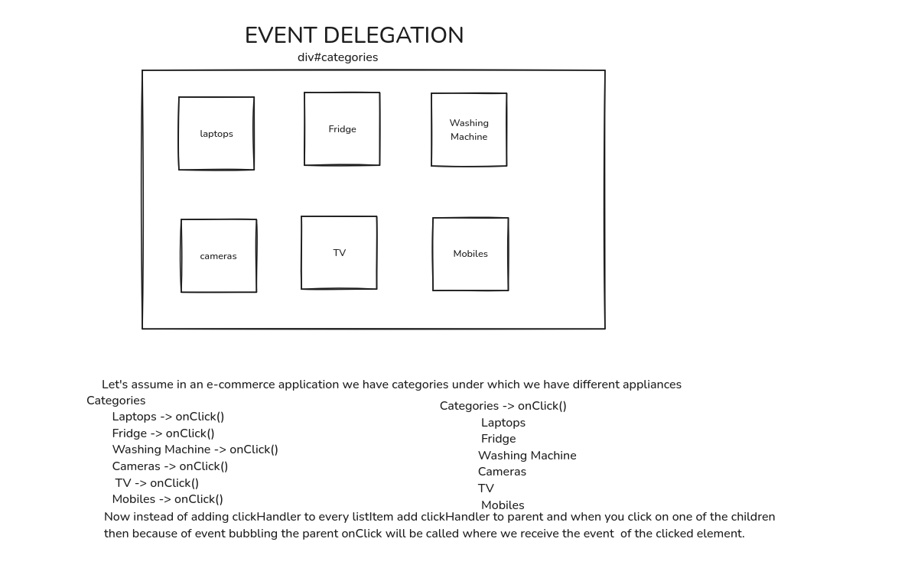

# Event Delegation in Javascript. (Exists because event bubbling exists)

Based on Event Bubbling



Instead of adding event listeners for every child tag add it to the parent tag.

Adding single event handler to parent.

Event Delegation is achieved only in javascript because event bubbling is possible.

Saves a lot of memory while attaching many event handlers.

## Usage with an example

```bash
//wrong way becomes expensive if there are multiple list elements
Categories
        Laptops -> onClick()
        Fridge -> onClick()
        Washing Machine -> onClick()
        Cameras -> onClick()
         TV -> onClick()
        Mobiles -> onClick()
```

```bash
//RIGHT WAY
Categories -> onClick()
        Laptops
        Fridge
        Washing Machine
        Cameras
         TV
        Mobiles
```


## Usage

```javascript

//HTML
 <div id="categories">
            <ul id="items">
                <li id="laptops">laptops</li>
                <li id="cameras">Cameras</li>
                <li id="mobiles">Mobiles</li>
                <li id="television">TV</li>
            </ul>
        </div>

//js
document.querySelector("#categories").addEventListener("click", (e) => {
  console.log(e);
  if(e.target.tagName == "LI") {
    window.location.href = "/" + e.target.id
  }
});

